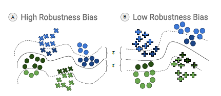
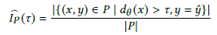
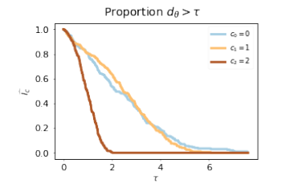
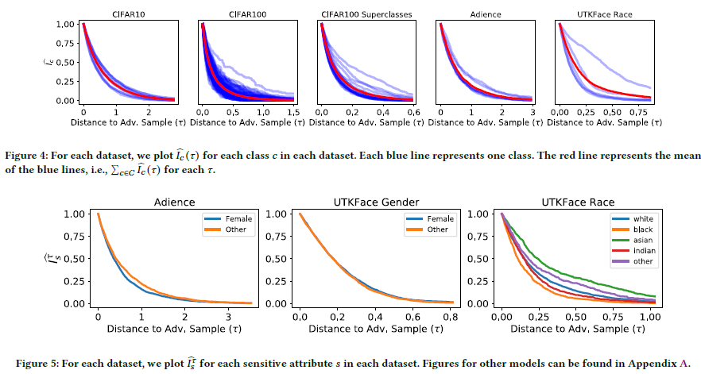
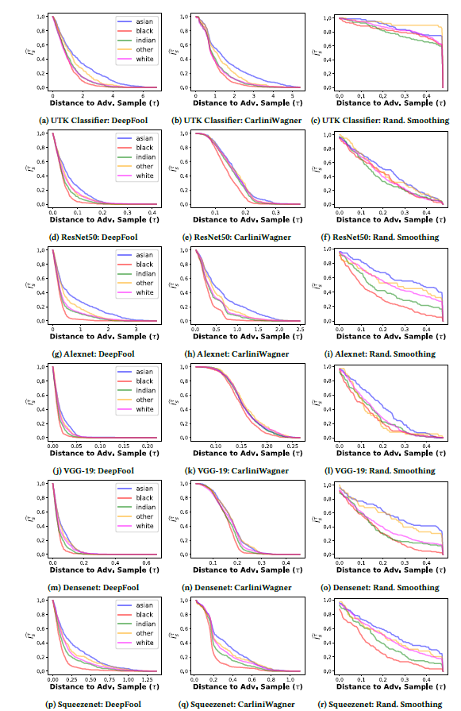

# Fairness Through Robustness阅读笔记

## 作者信息

- Vedant Nanda，University of Maryland
- Samuel Dooley，University of Maryland
- Sahil Singla，University of Maryland

## 会议期刊

- ACM FAccT ：ACM Conference on Fairness, Accountability, and Transparency

## 问题场景

针对于数据分布不均匀将会导致训练模型的偏见化，尽管目前学术界提出了很多评价数据公平性的相关指标，但是这些指标都是一次性的针对于静态数据的指标或者动态的指标。针对目前的现状，提出了一种新的数据评价指标robustness bias。

## Robustness Bias

鲁棒性偏见，指的是每个分类中样本点距离边界的样本比例，距离边界样本比例越高，鲁棒性偏见越高。

通过上述公式定义每个分类中的样本分布来衡量样本鲁棒性。如下图所示，c0、c1两类样本鲁棒性强于c2。

但是在实际场景中，度量鲁棒性偏见是一个不现实的工作，由于分界线是非凹函数，这将造成难以通过数学方式计算之间的距离，因此作者提出两种方式对样本到分界线之间的距离进行上下界度量。

- #### 对抗攻击

  通过对原有样本加入对抗性扰动，使得改变后的样本能够跨越分界线被划分为另外的分类，从而衡量出样本到边界线距离的上界。

- #### 随机平滑处理

  对于原有样本，计算出样本分类不被改变的最小半径范围，从而确定样本到边界线距离的下界。

## 实验结果

- ###  现有数据集分析

从图中可以发现，在CIFAR10、CIFAR100、Audience和UTKFace数据集中的样本分布均存在这或多或少的偏见性。

- ### 分类模型分析

## 总结

- 提出了一种新的公平性指标
- 提出了两种改指标的度量方法
- 在不同数据集和不同的分类模型上了验证了存在的鲁棒性偏见现象