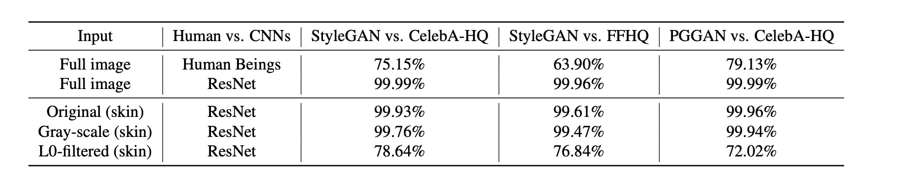
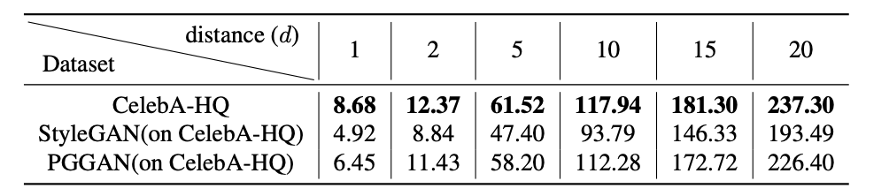
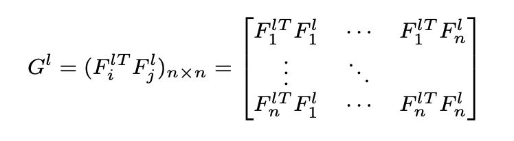
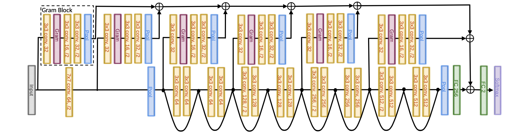
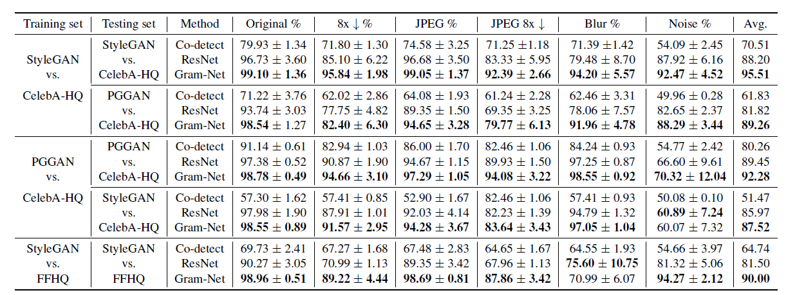
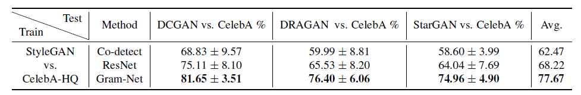
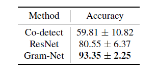
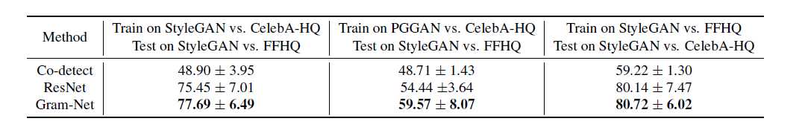

# GramNet阅读笔记

## 问题场景

1. 如何检测假脸仍然是一个未被探索的领域
2. 现有假脸来自于不同的GAN生成方法并经历了未知的图像干扰

## 思路分析

1. **人类主要观察图像中的人脸的形状和颜色**
2. **CNN主要检测图像的纹理特征**

通过一系列对比实验组，对CNN检测的图像的纹理特征进行了论证，如下图所示，其中a、b为参照组，c、d为a、b的灰度图像，隐去了色彩信息，e、f为通过L0过滤器去除图像纹理特征而保存边缘、色彩特征，从实验结果可以看出，CNN主要基于纹理信息进行鉴别分类。

 

3. **真实图像和伪造图像在纹理上存在区别**

通过GLCM矩阵对数据进行处理发现，伪造图像的对比度均低于真实图像，猜测是由于CNN关联附近像素的值导致对比度无法提升，具体原因留给之后去研究。

## ResNet局限性

通过实验发现，在下采样和jpeg压缩后的图像测试集上，ResNet的性能下降22%，在包含多种不同GAN生成的图像测试集上，准确率下降到64% − 75%。

## 解决思路

由于真实图像和伪造图像的对比度存在差别，同时经过下采样和压缩模糊的图像仍然保留了长纹理信息，因此可以通过**检测长纹理的对比度来判别图像是否伪造**，同时还提高了模型泛化能力。通过Gram矩阵来提取长纹理特征，其定义方式如下：

## GramNet架构

## 实验

### 数据集构建

分别将真实图像与伪造图像各自10000张作为训练集进行训练，伪造图像来源包括Style-GAN、PGGAN等。

验证集的构建包括512×512的原始输入、64×64的下采样图像、jpeg压缩的512×512图像、64×64jpeg压缩并且下采样图像。

### 实验过程与结果

* 首先将Co-detect、ResNet、GramNet三个网络分别在不同的伪造图片的训练集上进行训练并在测试集上进行测试，很明显的发现，GramNet的检测性能在普通模型的基础上提高了20%左右，并在ResNet的基础上提升了7%。

* 在低分辨率的GAN模型生成的伪造图片数据集上，尽管GramNet的性能下降到77%左右，但是其检测效果还是由于普通模型和ResNet。

* 在GAN模型的辨别器中加入Gram Block后，生成伪造的图像数据集，在该数据集上，GramNet仍然有优异的表现。

* 在交叉混合数据集上，GramNet的检测效果仍优于其他模型。

