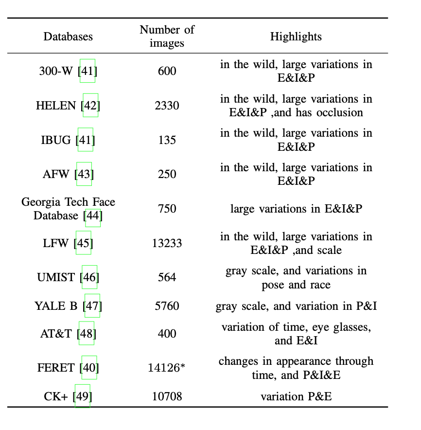

# Low Resolution Face Recognization阅读笔记

## 作者信息

##### Erfan Zangeneh

##### Mohammad Rahmati

##### Yalda Mohsenzadeh

## 会议期刊

##### Expert Systems with Applications

## 问题场景

尽管人脸检测比较普及，但是在人脸检测领域中针对低分辨率图像的检测研究比较少。论文针对于低分辨率检测能力低下的问题进行研究。

## 思路分析

### 现有的低分辨率人脸检测方法

* super- resolution：获取低分辨率图像的高分辨率版本，将后者用于人脸检测

* coupled mappings：通过大量数据，分别获取高分辨率图像和低分辨率图像的线性转换，分别将二者映射到相同的空间维度。

  

### 对比发现

第二种检测思路所取得的效果更好。由于第一种思路是将低分辨率转换为高分辨率，只是提升了可视化效果，不一定对人脸检测有直接的提升，而第二种 因此提升的效果更好。

但是第二种思路也存在一些弊端，低分辨率和高分辨率图像在映射到特定空间时所采取的映射方式都是线性映射，这一定程度上限制了映射，因此作者提出采用非线性映射的方式。

## 整体架构

* 对于输入的高分辨率和低分辨率图片，分别通过双三次差值方法将其转换为224x224的大小
* 使用预训练好的VGG16
* 在输入的数据集上训练SRNet
* 固定上分支FECNN，之后训练下分支SR+FECNN

### 优点

* 将VGG16中的后两层删除，只剩下一个全连接层，参数规模小。
* 特征标识性明显，VGG模型中的后三层用于分类，因此最后一层输出的4096维向量的特征性强

## 实验结果

### 数据集

### 测试集

* FB：正脸照片
* dupiicate1：重复照片
* fc：在同一天的不同光照条件下使用不同摄像机拍摄的照片
* duplicate2：重复的照片并与对应的高分辨率图片拍摄时间相差一年

### SRNet作用分析

针对SRNet在人脸识别中所起到的作用，设计四个对照组进行实验：

* SRNet与FECNN一起进行训练，更新二者参数
* 只有FECNN进行训练并更新参数，SRNet参数固定
* 采用稀疏编码替换SRNet
* 采用双三次差值替换SRNet

## 总结

* 通过非线性映射的双分支神经网络模型对于低分辨率人脸的识别具有良好的性能提升
* 通过删除VGG后层，在大幅减少训练参数的同时，提升了分类性能
* 通过实验验证了模型的有效性，以及SRNet的小型super-solution网络对于模型的影响