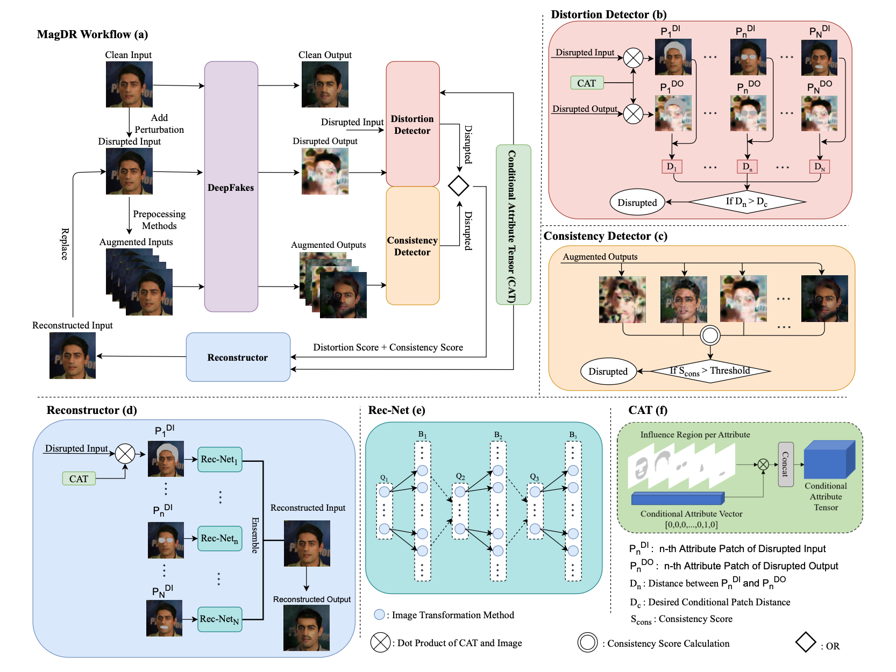
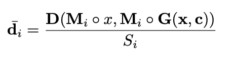
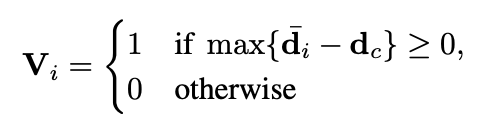
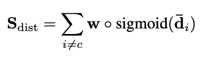
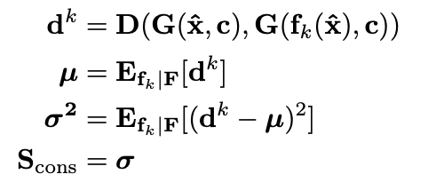
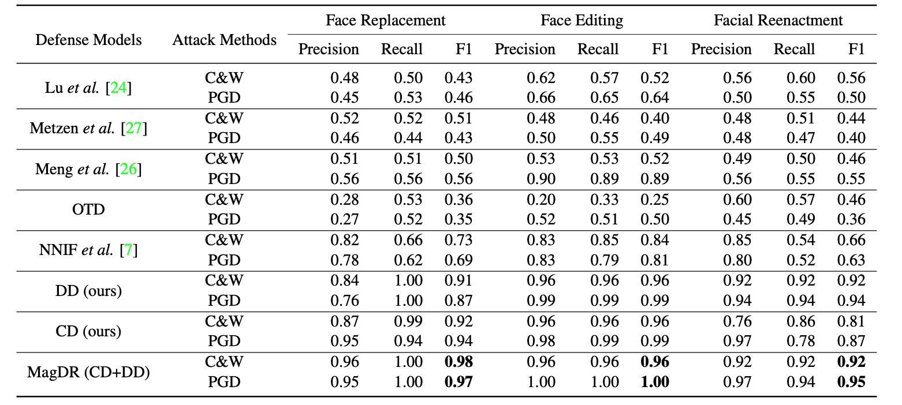
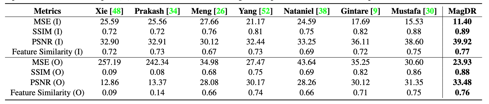
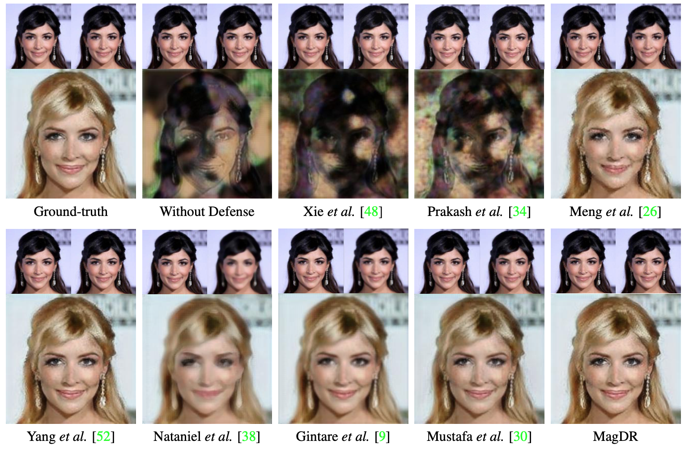

# MagDR阅读笔记

## 问题场景

由于deepfake的快速发展引发了社会对于隐私安全性的普遍担忧，越来越多的人开始研究对deepfake的防御。除了针对于图像或者视频的二分类检测外，还有人通过将样本添加波动（对抗性样本）使得deepfake生成模型失效。针对后者，作者提出了MagDR模型对样本进行检测，判断是否为对抗性样本。在对抗性样本的情况下，对样本进行重建去除其波动。

## 思路分析

1. 现有deepfake生成模型针对的是图像中特定的区域进行修改，比如人脸、眼部、鼻子、头发等部位。而特定区域出现异常区域是不合理的，因此可以作为判别依据。
2. 对于对抗性样本，在经过不同的图像增强处理之后，会破坏其原有的特性，样本不同增强处理之后，通过模型获取到的图像会不一致，因此也可以作为判断依据。

## 整体架构

首先，将样本通过Deepfake模型得到输出，将样本和该输出一起作为Distortion Detector的输入判断该样本是否为对抗性样本。同时将样本通过不同的图像增强算法进行增强后获取到不同的增强图像集输入到模型得到输出集，并将该输出集输入到Consistency Detector进行判断。将两个Detecor的结果做或运算判断该样本是否为对抗性样本。

判断为对抗性样本后，利用之前的特定区域Mask，通过重建算法对图像进行重建。

* Distortion Detector判别分数

  

  

  

* Consistency Detector判别分数

  

## 实验结果

* 对抗性样本判别结果

  

* 对抗性样本重建结果

  

  

## 总结

1. 提出了检测和重建双阶段框架用于防御对抗性攻击，核心思想计算一些对输出图像上的对抗扰动敏感的非监督标准。
2. 进行大量对比实验说明了模型有效性。