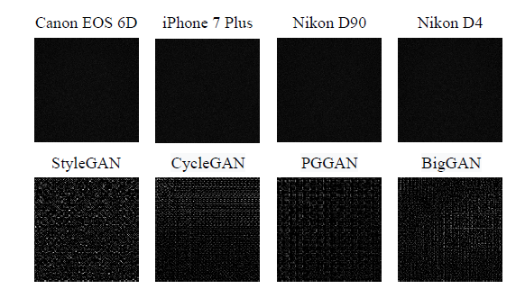
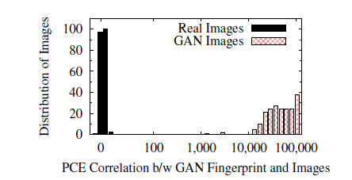
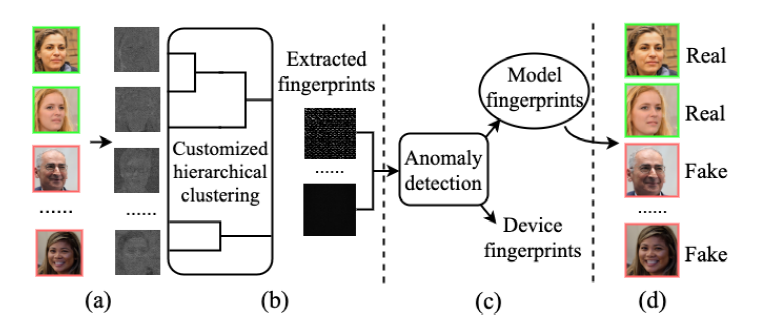
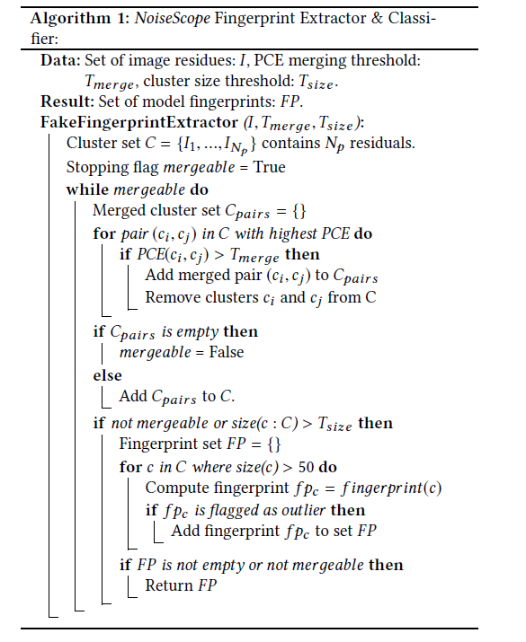

# NoiseScope阅读笔记

## 作者信息

- Jiameng Pu，Neal Mangaokar，Chandan K. Reddy，Bimal Viswanath：*Virginia* Poly*tech*nic Institute and State University（弗吉尼亚理工学院暨州立大学）

- Bolun Wang：FaceBook

## 会议期刊

Annual Computer Security Application Conference（ACSAC）2020

## 问题场景

现有针对与Deepfake的检测都主要聚焦在Identify Swap，即人脸替换，并没有针对于完全生成的伪造图片检测，本篇论文中特定针对于**完全生成的伪造图片**，提出了一种新的无监督检测思路。

## 思路分析

* GAN完全生成的图片类似于照相机拍出来的照片，具有特定的噪声模式，针对该点进行伪造图片检测。
* 
* 

## 整体架构

总体上分为四个阶段：

 1. 噪声残差提取

    使用Wavelet Denoising filter对测试集进行处理，提取出残差噪声

 2. 指纹提取

 3. 指纹分类

    

    

 4. 假图片检测

## 实验结果

## 总结

