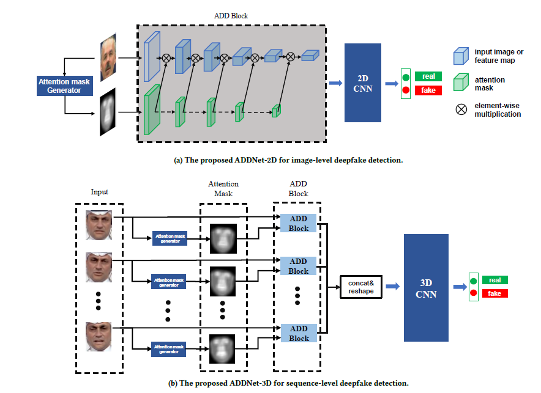

# WildDeepfake: A Challenging Real-World Dataset for Deepfake Detection阅读笔记
## 作者信息

Bojia Zi，复旦大学

Minghao Chang，复旦大学

Jingjing Chen，复旦大学

Xingjun Ma，复旦大学

Yu-Gang Jiang，复旦大学

## 会议期刊

ACM MULTIMEDIA CONFERENCE 2020

## 问题场景

现有深度伪造数据集包括Deepfake-TIMIT、FF+、DeepfakeDetectionDataset、DFDC等，它们基于从互联网上收集或者要求演员录制的视频，通过现有成熟的深度伪造技术而得到的数据。但是，这些数据集普遍存在弱点。包括：

- 缺少多样性

  由于原视频中的场景比较少，并且演员出演时的表情比较单一，从而导致整个数据集多样性较差，当检测技术在现有数据集上训练好之后，在实际场景中的表现效果往往并不是很理想。

- 画质、分辨率低

  由于深度伪造视频的训练时间较短，现有伪造数据集中的视频画质不清晰，会对模型训练产生一定的负面效果。

## 新数据集

从网上收集了1200个深度伪造视频， 去除采用传统方式深度伪造视频以及无法找到原视频的伪造视频后，剩下707个高质量的深度伪造视频。

## 检测架构

基于深度伪造过程中采用注意力机制， 在深度伪造检测过程中也采用注意力机制，mask的生成过程如下图所示。先通过mtcnn识别出人脸区域，之后检测人脸lanmark区域，分别生成face mask和organ mask，之后通过高斯模糊和归一化生成最终的mask。

整个模型通过注意力机制，使模型聚焦于重点区域，并在ADD Block中的每一个层都将mask与特征融合。

## 实验结果

分别对比AlexNet、VGG、ResNet、Inception、MesoNet、Xception、ADDNet在数据集DFD、DF-TIMIT LQ、DF-TIMIT HQ、FF++ LQ、FF+ HQ、Wild-Deepfake上的检测准确率，发现现有的图像分类网络在除了WildDeepfake之外的数据集上的表现性能均优秀，但是在WildDeepfake上的性能劣化，从而证明了WildDeepfake的有效性。

