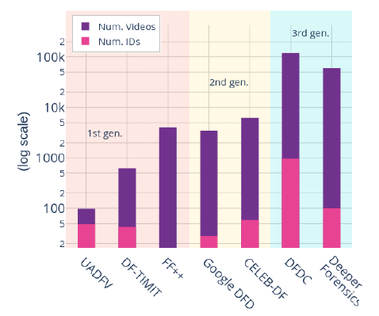
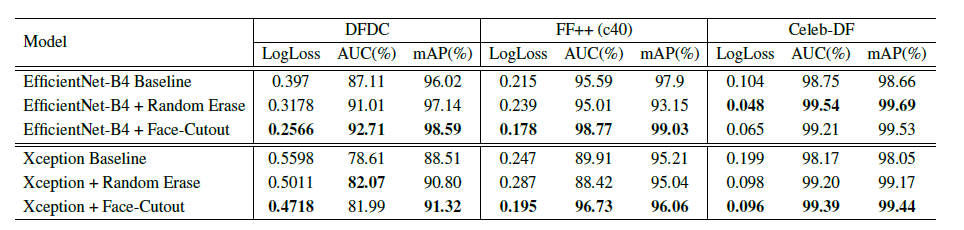

# Deepfake动态增强阅读笔记                                                      

## 1 作者信息

- Sowmen Das

  沙贾拉尔科技大学，孟加拉国

- Arup Datta

  沙贾拉尔科技大学，孟加拉国

- Md. Saiful Islam

  沙贾拉尔科技大学，孟加拉国

- Md. Ruhul Amin

  福特汉姆大学，美国

## 2 会议期刊

- 在投中

## 3 问题场景

**在Deepfake检测模型的训练中，多使用正面面部的图片用于训练，这将导致网络模型倾向于面部特征而不是实际上被修改的区域特征，这导致检测模型在对未见过的样本进行分类是效果较差。**

## 4 思路分析

### 4.1 数据集分析

分析各个数据集中的"独特"的视频数以及“独特”的人数。分析发现各个数据集中，大部分的视频同属于同一个视频，例如一个真实视频，经过多个深度伪造算法能够生成多个伪造视频，而模型在训练时，由于有效样本数较少，因此很容易导致模型的过拟合，使得模型倾向于有效样本中的人脸特征。

### 4.2 大致思路

通过以上分析，可以通过忽略有效样本中的面部信息来使模型更加倾向于深度伪造特征。作者采用动态擦除技术用于数据集增强。首先利用Dlib生成每个样本图片的68点人脸landmark区域，之后采用对照组用于实现数据增强。

#### 4.2.1 器官组移除

- 眼睛
- 鼻子
- 嘴巴

每次分别按照概率p擦除上述区域之一，同时利用SSIM计算原图像和伪造图像之间的像素级别差异，如果擦除区域中的伪造像素占全局伪造像素的比例低于阈值，则将该区域进行擦除，并用于训练。

## 5 实验过程

### 5.1 模型选取

- EfficientNet-B4

  EfficientNet系列中参数最少，训练快

- XceptionNet

  作为baseline模型用于对比

### 5.2 数据预处理

将样本进行归一化处理，mean=(0:485; 0:456; 0:406)，deviation=(0:229; 0:224; 0:225)

### 5.3 优化器

Adam优化器：learning_rate=0.001 weight decay=0.0005

### 5.4 评估指标

- AUC of ROC
- mAP

### 5.5 实验结果

## 6 总结想法

### 6.1 论文贡献

- 对流行的Deep-Fake数据集进行了全面分析，找出其缺点。 展示了使用面部聚类评估数据集及其在数据预处理中的应用，以减轻过度拟合的情况。
- 提出了擦除技术Face-Cutout，它使用面部地标和基础图像信息来动态确定用于增强的切口区域。

### 6.2 想法

- 论文提出的动态擦除技术类似于注意力机制，都是通过对图像样本进行区域性忽略来提高模型的性能。不同的是，论文中的动态擦除更具有针对性，通过人脸landmark来对区域进行许选取，效果会更强。

