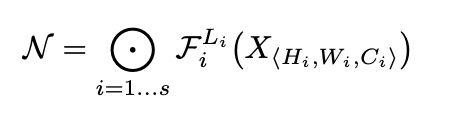
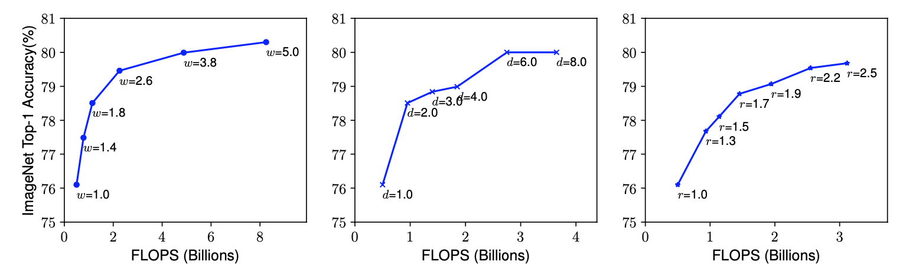
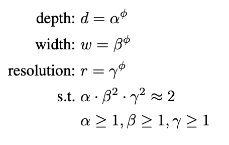
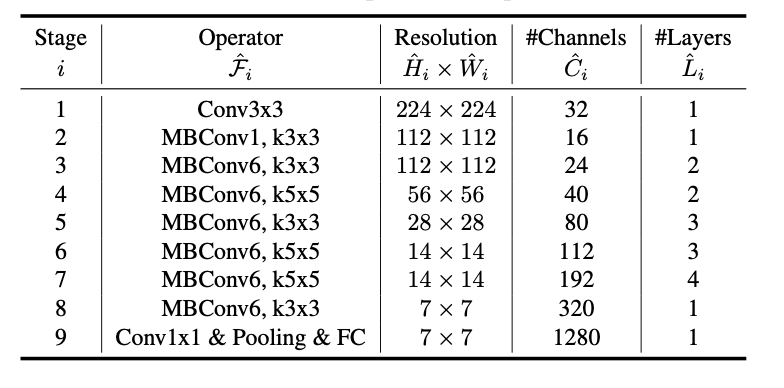
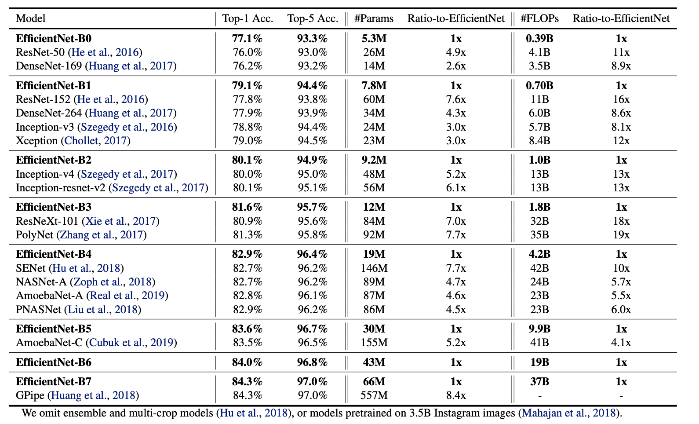

# EfficientNet阅读笔记

## 1. 问题场景

目前，很多面向于图像分类任务的神经网络被提出， 包括Alexnet、VGG、ResNet、Xception、MobileNet等等。研究学者们发现，当对现有的分类模型进行扩展后，能够取得更好的分类效果，包括增加网络深度、增加网络宽度以及增加输入大小。但是，如何去有效的进行扩展现有网络还没有一个相对标准的准则。针对该问题，论文研究网络深度、宽度和输入之间的最佳扩展关系并验证其有效性。

## 2. 核心思路

### 2.1 问题抽象

对网络模型的扩展归根结底是想提升模型的检测性能，首先将网络模型进行抽象，如下图公示：

其中Fi表示阶段i的网络层，Li表示该网络层重复的次数，Hi、Wi、Ci分别表示输入图像高度、宽度和通道数。

因此最后该问题可以被抽象为如下的最优化问题，在设定最小消耗前提下，使得模型准确率最高。

### 2.2 扩展因子

目前对于模型的扩展主要有三个方向，分别为深度、宽度、分辨率。下图显示了在不同条件下FLOPS和acc的关系，明显可以发现，分别随着宽度、深度、以及分辨率的增加，模型准确率不断上升，但是最后会停滞，同时也会带来很大的计算性能开销。

### 2.3 混合扩展

其中α、β、γ是采用grid serach获取到的最佳混合比例，φ是用户设置的系数。

## 3. 网络架构

通过多因子神经架构搜索获取到B0版本，之后设置φ为1，通过grid search在限定条件下α·β2·γ2 ≈2获取到最佳α=1.2、β=1.1、γ=1.15。之后分别设置φ为2，3等获取到B1～ B7的网络版本。

## 4. 实验结果

## 5. 论文贡献

- 量化了扩展模型时宽度、深度和分辨率的关系并通过数据证明了其有效性
- 提出了EfficientNet B0～B7模型，分别在ImageNet上进行了测试