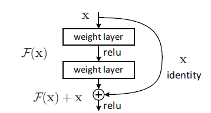
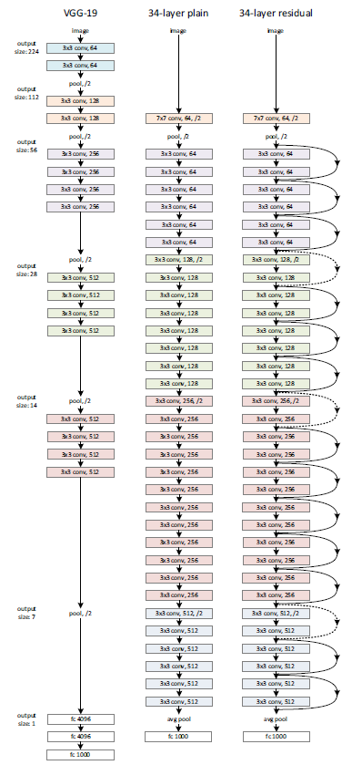
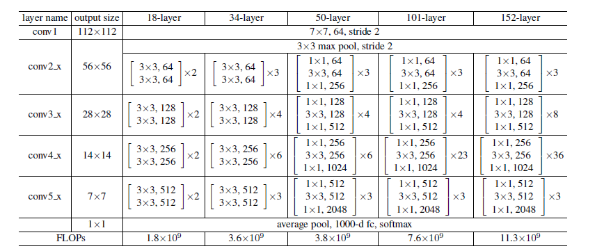
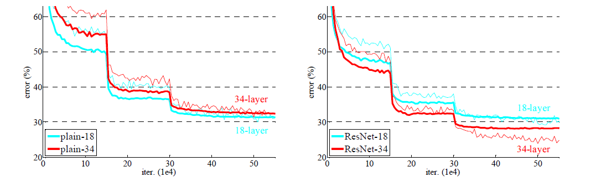
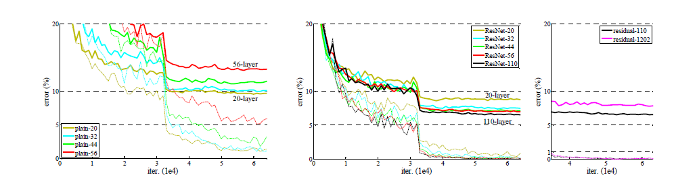

# ResNet阅读笔记

## 针对问题场景

* 梯度消失/梯度爆炸

  假设网络的在传播过程中的梯度为小于1的值，在若干次传播后梯度值将逐渐趋近于0导致梯度消失，梯度爆炸亦同理。

* 梯度退化

## 核心要点

引入了残差网络块，通过下图所示的残差网络块来改善网络性能，仅仅引入了可以忽略的额外计算开销。

## 网络架构

## 实验过程及结果

### 数据预处理

1. 对图像按照最短边在[256,480]范围内进行等比例缩放
2. 随机裁剪224×224大小的区域
3. 归一化
4. 颜色抖动

### 实验结果

在ImageNet上的实验结果如下图，在左图中表明了出现了梯度退化的现象，在右图中加入了残差块之后，错误率下降，收敛速度变快，并解决了梯度退化问题。

在CIFAR-10上的实验结果如下图。

## 论文贡献

* 提出了残差块的概念并有效的解决了梯度退化的问题
* 通过大量实验证明了ResNet的有效性
* 进行了一些列的对比实验测试了更深层残差网络的有效性并分析